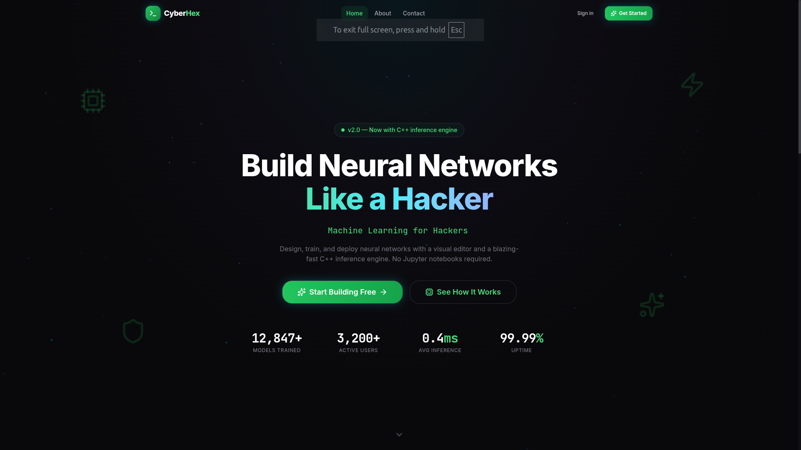
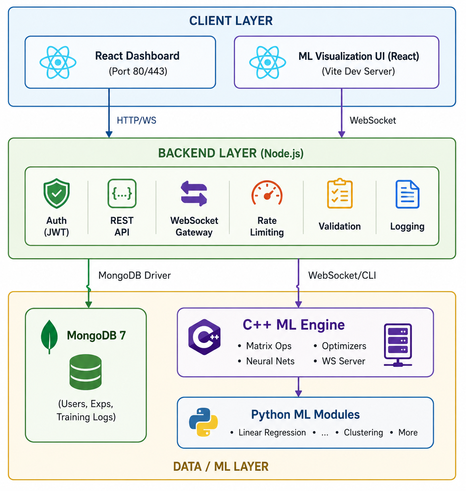

# CyberHex — Full-Stack Machine Learning Platform

<p align="center">
  
</p>

> **Project Status: Actively Under Development**
>
> This repository represents the **current state of an ongoing project.**
> Features, structure, and performance are continuously evolving.

---

CyberHex is a **full-stack machine learning platform** that combines a custom C++ neural network engine, a Python ML module suite, a Node.js/Express backend, and a modern React dashboard — all containerized with Docker.

A **public web showcase** (`/public-web`) is included in this repository: a standalone Vite + React + TypeScript single-page site that documents the project in a visual, interactive format.

---

## Table of Contents

- [Features](#features)
- [Tech Stack](#tech-stack)
- [Architecture](#architecture)
- [Project Structure](#project-structure)
- [Public Web Showcase](#public-web-showcase)
- [Screenshots](#screenshots)
- [Getting Started](#getting-started)
  - [Prerequisites](#prerequisites)
  - [Docker Setup (Recommended)](#docker-setup-recommended)
  - [Local Development Setup](#local-development-setup)
- [API Documentation](#api-documentation)
- [ML Engine](#ml-engine)
  - [C++ Modules](#c-modules)
  - [Python Modules](#python-modules)
  - [Visualization UI](#visualization-ui)
- [Testing](#testing)
- [Author & Ownership](#author--ownership)
- [License](#license)

---

## Features

### Core ML Engine (C++)
- Custom `Matrix` implementation using `std::vector` with OpenMP parallelism
- Dense (fully connected) layers with forward/backward propagation
- Activation functions: **ReLU**, **Sigmoid**, **Softmax** (with Jacobian backprop)
- Multiple optimizers: **SGD**, **Momentum**, **RMSProp**, **ADAM**
- MSE loss function with epoch-based training loop
- Best-model tracking with automatic checkpoint saving
- Native C++ WebSocket server for real-time training data streaming

### Python ML Suite
- Linear regression and additional algorithm implementations
- Modular commons library for statistical functions (mean, variance, etc.)

### Backend (Node.js/Express)
- RESTful API with **JWT-based authentication** (access + refresh tokens)
- User registration, login, email verification, and password management
- Experiment management and training log persistence via **MongoDB + Mongoose**
- Real-time WebSocket endpoints for live ML training data
- Rate limiting, CORS, Helmet security, input validation (express-validator + Zod)
- Structured logging with Winston

### Frontend (React + TypeScript)
- **Landing page** with animated hero, feature showcases, and CTAs
- **Dashboard** with experiment builder, model overview, and training charts
- **CyberGames** — interactive ML educational games
- **Model visualization** — real-time training loss and metrics via Recharts
- Authentication flows: sign-up (multi-step), sign-in, protected routes
- Multi-theme system with 6 variants: **Cyber**, **Nebula**, **Midnight**, **Plasma**, **Aurora**, **Emerald** — plus dark/light mode
- State management with **Zustand**, animations with **Framer Motion**
- Responsive UI built with **Tailwind CSS** and **shadcn/ui** (Radix primitives)

### Public Web Showcase (`/public-web`)
- Standalone **Vite + React + TypeScript** single-page application
- Visually documents the entire platform: features, architecture, API, ML engine, and author
- Green-themed dark design with glassmorphism, grid animations, and scroll-triggered reveals
- Fully static — no backend required; deployable to any CDN or static host

### DevOps & Infrastructure
- Full **Docker Compose** setup (MongoDB, backend, frontend via nginx)
- Health checks, restart policies, and bridged networking
- Environment-based configuration with `.env` support
- Build scripts and pre-commit hooks with Husky

---

## Tech Stack

| Layer          | Technology                                                                 |
| -------------- | -------------------------------------------------------------------------- |
| **ML Engine**  | C++17, OpenMP, custom linear algebra                                      |
| **Python ML**  | Python 3, NumPy                                                            |
| **Backend**    | Node.js, Express 5, MongoDB/Mongoose, WebSockets (ws), JWT                 |
| **Frontend**   | React 19, TypeScript, Vite, Tailwind CSS, shadcn/ui, Recharts, Zustand    |
| **ML Viz UI**  | React, TypeScript, Vite, Recharts                                          |
| **Public Web** | React, TypeScript, Vite (standalone static site)                           |
| **Testing**    | Jest (backend), Vitest (frontend), Catch2 (C++)                           |
| **Infra**      | Docker, Docker Compose, Nginx, MongoDB 7                                  |

---

## Architecture

<p align="center">
  
</p>

```
┌──────────────────────────────────────────────────────────┐
│                      CLIENT LAYER                         │
│  ┌──────────────────┐  ┌───────────────────────────────┐ │
│  │  React Dashboard  │  │  ML Visualization UI (React)  │ │
│  │  (Port 80/443)    │  │  (Vite Dev Server)            │ │
│  └────────┬─────────┘  └──────────────┬────────────────┘ │
└───────────┼───────────────────────────┼──────────────────┘
            │ HTTP/WS                   │ WebSocket
┌───────────┼───────────────────────────┼──────────────────┐
│           ▼                           ▼                   │
│  ┌─────────────────────────────────────────────────────┐ │
│  │              BACKEND LAYER (Node.js)                │ │
│  │  • Auth (JWT)  • REST API  • WebSocket Gateway      │ │
│  │  • Rate Limiting  • Validation  • Logging           │ │
│  └──────────┬──────────────────────────┬───────────────┘ │
└─────────────┼──────────────────────────┼─────────────────┘
              │ MongoDB Driver           │ WebSocket/CLI
┌─────────────┼──────────────────────────┼─────────────────┐
│             ▼                          ▼                  │
│  ┌──────────────────┐  ┌──────────────────────────────┐ │
│  │  MongoDB 7       │  │  C++ ML Engine                │ │
│  │  (Users, Exps,   │  │  • Matrix Ops  • Neural Nets  │ │
│  │   Training Logs)  │  │  • Optimizers  • WS Server    │ │
│  └──────────────────┘  └──────────────┬───────────────┘ │
│                                       │                   │
│                          ┌────────────┴───────────────┐  │
│                          │  Python ML Modules          │  │
│                          │  • Linear Regression  • ... │  │
│                          └────────────────────────────┘  │
│                             DATA / ML LAYER              │
└──────────────────────────────────────────────────────────┘
```

---

## Project Structure

```
CyberHex/
├── backend/                          # Express.js API server
│   ├── controllers/                  # Route handlers (auth, users, experiments)
│   ├── middleware/                    # Auth, error handling, rate limiting, validation
│   ├── models/                       # Mongoose schemas (User, Experiment, Model, TrainingLog)
│   ├── routes/                       # API route definitions
│   ├── tests/                        # Jest test suites
│   ├── utils/                        # Logger, DB init, env config, validators
│   ├── Dockerfile
│   └── app.js / index.js             # Express app bootstrap & server entry
│
├── client/                           # React dashboard (Vite + TypeScript)
│   ├── src/
│   │   ├── assets/                   # Images, fonts, videos
│   │   ├── components/               # UI components (ui/, dashboard/, signup/, navbar/, etc.)
│   │   ├── contexts/                 # Auth context provider
│   │   ├── hooks/                    # Custom hooks (useWebSocket)
│   │   ├── lib/                      # API client, design tokens, utilities
│   │   ├── pages/                    # Landing, Dashboard, CyberGames, Models, Settings, 404
│   │   ├── stores/                   # Zustand state stores
│   │   └── tests/                    # Vitest unit & E2E tests
│   ├── Dockerfile
│   ├── nginx.conf                    # Production nginx configuration
│   └── vite.config.ts
│
├── public-web/                       # Public project showcase site (Vite + React + TypeScript)
│   ├── src/
│   │   ├── App.tsx                   # Root: assembles all sections
│   │   ├── components.tsx            # All page sections (Hero, Features, API, etc.)
│   │   └── index.css                 # Full design system (dark green glassmorphism)
│   ├── index.html
│   └── vite.config.ts
│
├── ML/
│   ├── models/
│   │   ├── cpp-modules/              # C++ ML engine
│   │   │   ├── include/              # Headers (matrix, layer, dense, activations, model, etc.)
│   │   │   ├── src/                  # Implementations
│   │   │   ├── models/best_model/    # Saved weights, biases, and loss history
│   │   │   └── CMakeLists.txt
│   │   └── python-modules/           # Python ML algorithms
│   │       ├── main.py
│   │       ├── linear-regression.py
│   │       └── commons/              # Shared statistical utilities
│   ├── ui/visualizations/            # Standalone ML visualization dashboard
│   │   └── src/                      # React components for training viz
│   └── scripts/                      # Benchmarking and analysis scripts
│
├── scripts/                          # Build and utility scripts
├── logs/                             # Application logs
├── docker-compose.yml                # Multi-service orchestration
├── openapi.yaml                      # API specification (OpenAPI 3.0)
├── .env.example                      # Environment variable template
├── package.json                      # Root workspace scripts
├── LICENSE
└── NOTICE
```

---

## Public Web Showcase

The `/public-web` directory contains a standalone, static single-page application that serves as a visual and interactive documentation site for CyberHex.

Built with **Vite + React + TypeScript**, it requires no backend and can be deployed to any static hosting provider (GitHub Pages, Vercel, Netlify, etc.).

### Run locally

```bash
cd public-web
npm install
npm run dev
# Opens at http://localhost:5173
```

### Build for production

```bash
cd public-web
npm run build
# Output in public-web/dist/
```

### What it covers

- Platform overview and animated hero with live stats
- Feature cards for each major module
- ASCII architecture diagram
- Full tech stack breakdown with layer table
- C++ ML engine component reference
- REST + WebSocket API endpoint table
- Docker quick-start guide
- Testing strategy by layer
- Author section with social links

---

## Screenshots

### Landing Page
<p align="center">
  
</p>

### Dashboard & Experiment Builder
<p align="center">
  
</p>
<p align="center">
  
</p>

### Model Training & Visualization
<p align="center">
  
</p>
<p align="center">
  
</p>

### Authentication
<p align="center">
  
  
</p>

### CyberGames
<p align="center">
  
</p>

---

## Getting Started

### Prerequisites

- **Docker** & **Docker Compose** (recommended)
- **Node.js 18+** & **npm** or **yarn** (for local dev)
- **MongoDB 7** (if running locally without Docker)
- **CMake 3.14+** and a C++17 compiler (for the C++ ML engine)
- **Python 3.8+** (for Python ML modules)

### Docker Setup (Recommended)

1. **Clone the repository**

   ```bash
   git clone https://github.com/DulshanSiriwardhana/CyberHex.git
   cd CyberHex
   ```

2. **Configure environment variables**

   ```bash
   cp .env.example .env
   # Edit .env with your configuration (or use defaults for development)
   ```

3. **Build and start all services**

   ```bash
   docker compose up --build -d
   ```

4. **Access the application**

   | Service    | URL                     |
   | ---------- | ----------------------- |
   | Frontend   | http://localhost:80     |
   | Backend    | http://localhost:5000   |
   | MongoDB    | localhost:27017         |

5. **Stop services**

   ```bash
   docker compose down
   ```

### Local Development Setup

<details>
<summary>Click to expand local development instructions</summary>

#### 1. Install root dependencies and sub-project dependencies

```bash
npm run setup
```

#### 2. Start MongoDB (local or Docker)

```bash
docker run -d -p 27017:27017 --name cyberhex-mongo mongo:7-alpine
```

#### 3. Configure backend environment

```bash
cp .env.example backend/.env
```

#### 4. Start the backend (development mode)

```bash
npm run dev:backend
```

The backend runs at `http://localhost:5000`.

#### 5. Start the frontend (development mode)

```bash
npm run dev:frontend
```

The frontend runs at `http://localhost:5173`.

#### 6. Start the public web showcase (development mode)

```bash
cd public-web && npm run dev
```

The showcase runs at `http://localhost:5173` (or next available port).

#### 7. Build the C++ ML engine

```bash
cd ML/models/cpp-modules
mkdir build && cd build
cmake ..
make -j$(nproc)
```

#### 8. Run Python ML modules

```bash
cd ML/models/python-modules
python main.py
```

</details>

---

## API Documentation

The full API specification is available in [openapi.yaml](./openapi.yaml) (OpenAPI 3.0 format).

### Quick Reference

| Method   | Endpoint                  | Description              | Auth |
| -------- | ------------------------- | ------------------------ | ---- |
| `POST`   | `/api/v1/auth/register`   | Register a new user      | No   |
| `POST`   | `/api/v1/auth/login`      | Login user               | No   |
| `POST`   | `/api/v1/auth/refresh`    | Refresh access token     | No   |
| `POST`   | `/api/v1/auth/logout`     | Logout user              | Yes  |
| `GET`    | `/api/v1/users/me`        | Get current user profile | Yes  |
| `PUT`    | `/api/v1/users/me`        | Update profile           | Yes  |
| `GET`    | `/api/v1/experiments`     | List experiments         | Yes  |
| `POST`   | `/api/v1/experiments`     | Create experiment        | Yes  |
| `GET`    | `/api/v1/experiments/:id` | Get experiment by ID     | Yes  |
| `DELETE` | `/api/v1/experiments/:id` | Delete experiment        | Yes  |
| `GET`    | `/api/v1/health`          | Health check             | No   |
| `WS`     | `/api/v1/ws`              | WebSocket training feed  | Yes  |

---

## ML Engine

### C++ Modules

The core ML engine is a custom C++17 framework built from scratch:

| Component          | Description                                                      |
| ------------------ | ---------------------------------------------------------------- |
| `Matrix`           | Generic 2D matrix with vectorized operations and OpenMP support  |
| `Layer` (base)     | Abstract base class for all neural network layers                |
| `Dense`            | Fully connected layer with configurable input/output dimensions  |
| `Activations`      | ReLU, Sigmoid, and Softmax with full forward/backward passes     |
| `Model`            | Layer container with training loop, loss tracking, and saving    |
| `Optimizers`       | SGD, Momentum, RMSProp, ADAM implementations                     |
| `Loss`             | Mean Squared Error (MSE) loss function                           |
| `Metrics`          | Accuracy, precision, and other evaluation metrics                |
| `WS Server`        | Native WebSocket server for streaming training data in real-time |

**Build & Run:**

```bash
cd ML/models/cpp-modules
mkdir -p build && cd build
cmake .. && make -j$(nproc)
./cyberhex_ml
```

**Run Tests:**

```bash
cd ML/models/cpp-modules/build
ctest --output-on-failure
```

### Python Modules

Additional ML algorithms implemented in Python:

- **Linear Regression** — gradient descent from scratch
- **Commons** — shared statistical utilities (mean, variance, standard deviation)

```bash
cd ML/models/python-modules
python main.py
```

### Visualization UI

A standalone React dashboard for real-time ML training visualization, with WebSocket data streaming and interactive loss/accuracy charts.

```bash
cd ML/ui/visualizations
yarn install
yarn dev
```

<p align="center">
  
</p>

---

## Testing

| Layer       | Framework | Command                          |
| ----------- | --------- | -------------------------------- |
| Backend     | Jest      | `npm test` (in `backend/`)       |
| Frontend    | Vitest    | `npm test` (in `client/`)        |
| C++ Engine  | Catch2    | `ctest` (in `ML/.../build/`)     |

---

## Author & Ownership

This project is fully designed, developed, and maintained by:

**Dulshan Siriwardhana**

- GitHub: [github.com/DulshanSiriwardhana](https://github.com/DulshanSiriwardhana)
- Portfolio: [dulshansiriwardhana.live](http://dulshansiriwardhana.live)
- LinkedIn: [linkedin.com/in/dulshansiriwardhana](https://www.linkedin.com/in/dulshansiriwardhana)

> I am the sole owner and author of CyberHex. All core systems — including the matrix engine,
> neural network architecture, training pipeline, backend services, frontend dashboard,
> and real-time visualization — are built entirely from scratch as part of this project.

---

## License

This project is licensed under the **Apache License 2.0**. See the [LICENSE](./LICENSE) file for details.