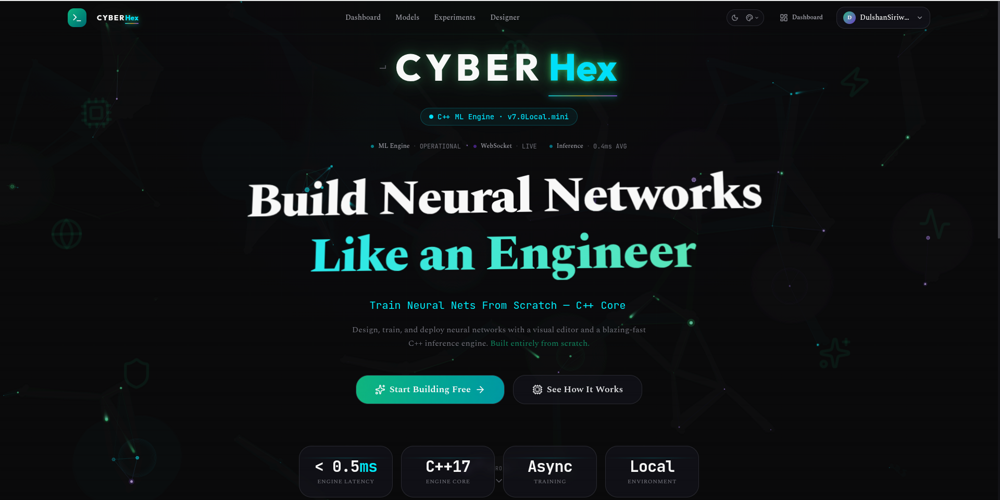
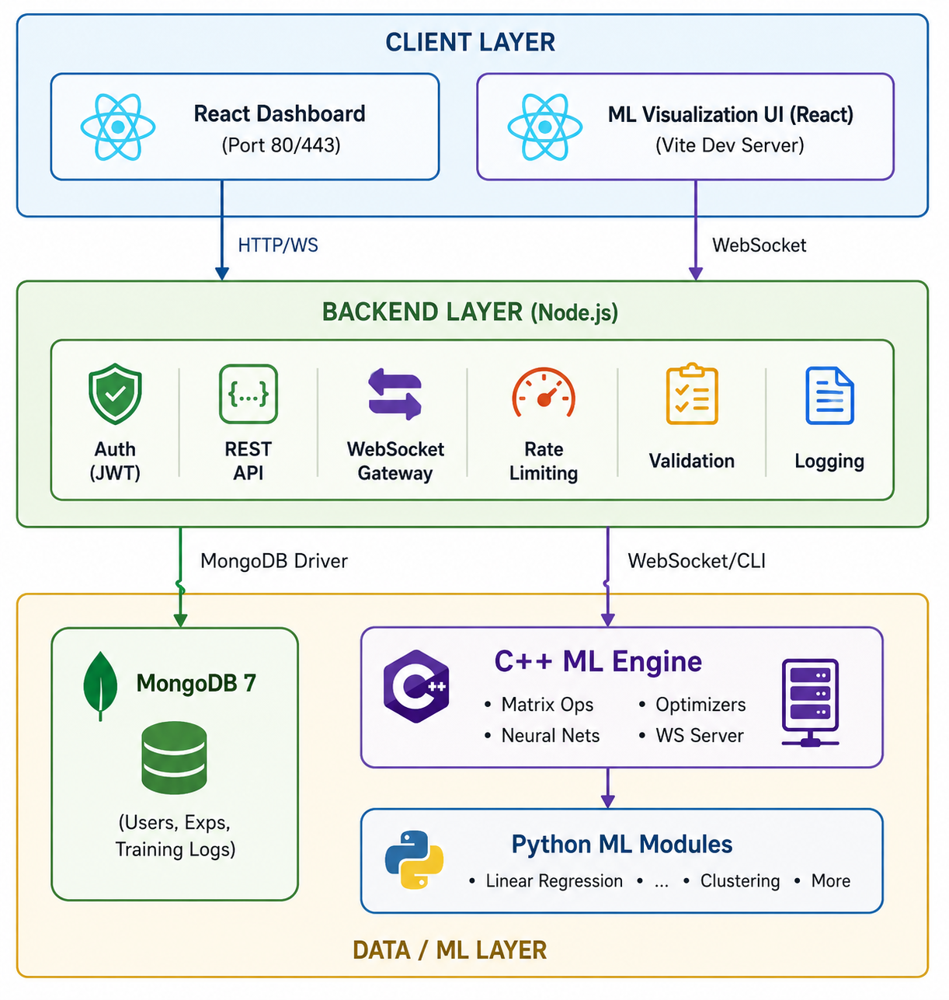
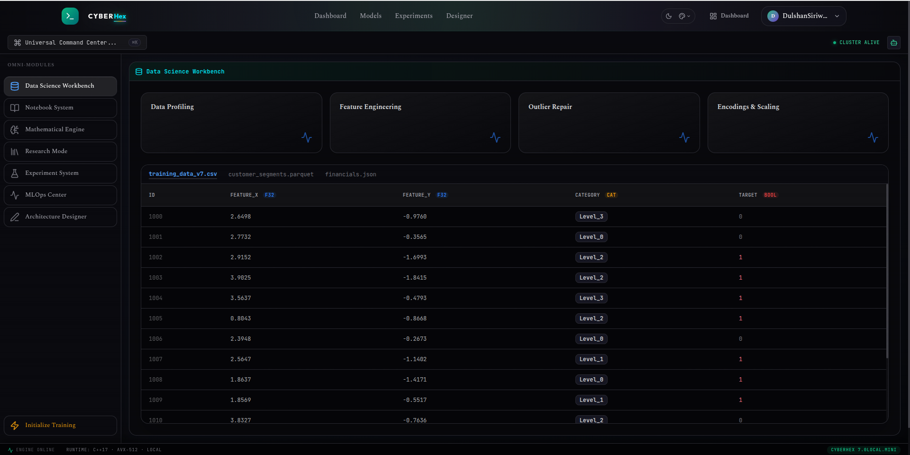
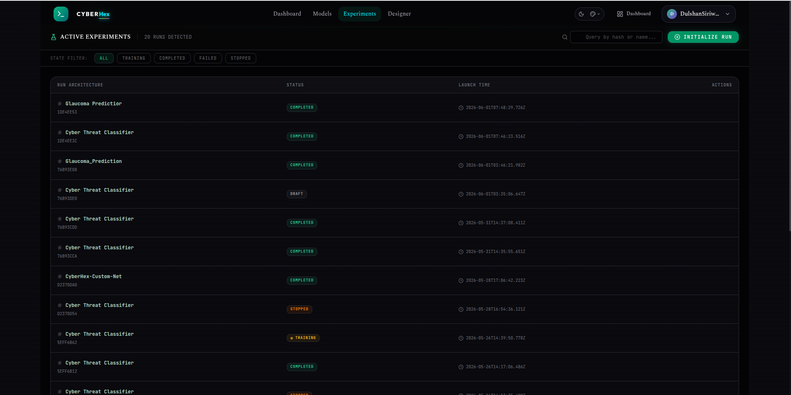
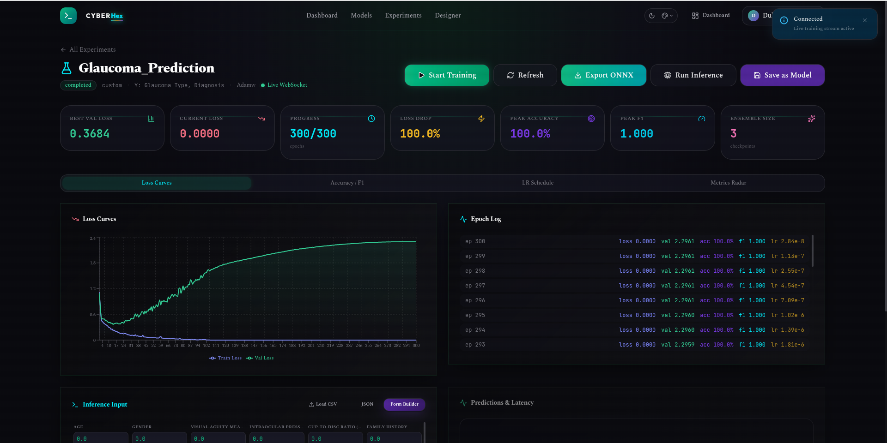
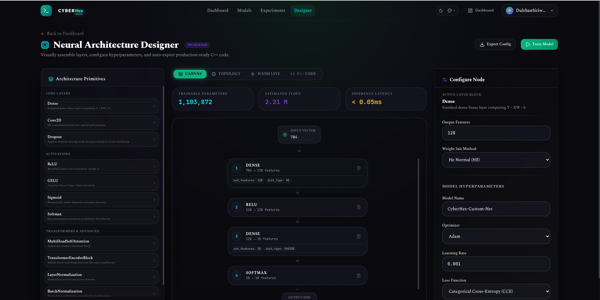
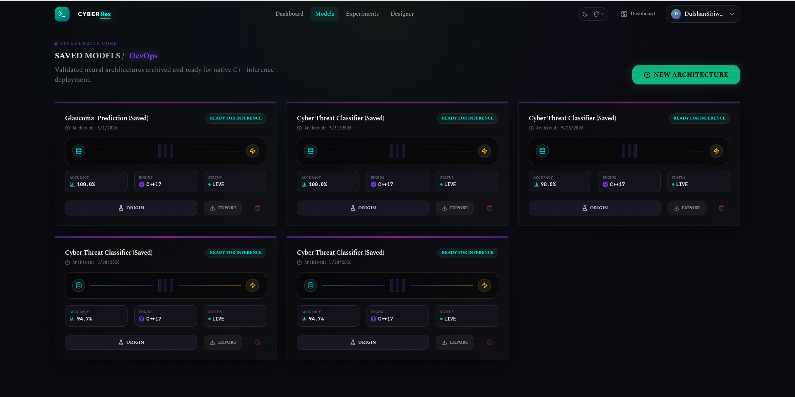

# CyberHex — Full-Stack Machine Learning Platform

<p align="center">
  
</p>

> **Project Status: Actively Under Development**
>
> This repository represents the **current state of an ongoing project.**
> Features, structure, and performance are continuously evolving.

---

---

CyberHex is a **private, high-performance machine learning platform** designed for technical engineers who demand speed, precision, and absolute control. It combines a custom C++17 neural network core with a modular React dashboard — allowing you to design, train, and deploy models entirely on your own terms.

---

## Table of Contents

- [Features](#features)
- [Tech Stack](#tech-stack)
- [Architecture](#architecture)
- [Project Structure](#project-structure)
- [Screenshots](#screenshots)
- [Getting Started](#getting-started)
  - [Prerequisites](#prerequisites)
  - [Docker Setup (Recommended)](#docker-setup-recommended)
  - [Local Development Setup](#local-development-setup)
- [API Documentation](#api-documentation)
- [ML Engine](#ml-engine)
  - [C++ Modules](#c-modules)
  - [Python Modules](#python-modules)
  - [Studio (Neural Rendering)](#studio-neural-rendering)
- [Testing](#testing)
- [Author & Ownership](#author--ownership)
- [License](#license)

---

## Features

### Core ML Engine (C++17)
- **Bare-Metal Speed**: Custom `Matrix` implementation using OpenMP parallelism and AVX-512 routines.
- **High-Performance Ingestion**: Supports streaming of massive datasets via disk-buffered `DataGenerator`.
- **Advanced Primitives**: AdamW, RAdam, Lion optimizers; Cosine Annealing; Gradient Clipping.
- **Native WebSockets**: Integrated C++ WebSocket server for ultra-low latency training telemetry.
- **Model Evolution**: Ensemble checkpointing and automatic "best-model" tracking.

### Engineering Dashboard (React + TS)
- **Architecture Designer**: Visually assemble deep networks with a drag-and-drop layer editor.
- **Real-Time Metrics**: High-fidelity charts for loss, accuracy, F1, and precision via WebSocket streams.
- **Model Management**: Comprehensive interface for organizing, comparing, and exporting models.
- **Local-First Design**: Optimized for private-instance deployments with no external dependencies.
- **Adaptive Aesthetics**: Spectral typography with custom green-focused engineering themes.

### Studio & Vision
- **Neural Communication**: Integrated video/audio studio with real-time neural filters.
- **GPU Acceleration**: WebGPU and WASM powered inference for near-zero latency threat detection.
- **Native Inference**: Export models to ONNX or deploy directly to the C++ inference engine.

---### DevOps & Infrastructure
- Full **Docker Compose** setup (MongoDB, backend, frontend via nginx)
- Health checks, restart policies, and bridged networking
- Environment-based configuration with `.env` support
- Build scripts and pre-commit hooks with Husky

---

## Tech Stack

| Layer          | Technology                                                                 |
| -------------- | -------------------------------------------------------------------------- |
| **ML Engine**  | C++17, OpenMP, custom linear algebra                                      |
| **Python ML**  | Python 3, NumPy                                                            |
| **Backend**    | Node.js, Express 5, MongoDB/Mongoose, WebSockets (ws), JWT                 |
| **Frontend**   | React 19, TypeScript, Vite, Tailwind CSS, shadcn/ui, Recharts, Zustand    |
| **ML Viz UI**  | React, TypeScript, Vite, Recharts                                          |
| **Public Web** | React, TypeScript, Vite (standalone static site)                           |
| **Testing**    | Jest (backend), Vitest (frontend), Catch2 (C++)                           |
| **Infra**      | Docker, Docker Compose, Nginx, MongoDB 7                                  |

---

## Architecture

<p align="center">
  
</p>

```
┌──────────────────────────────────────────────────────────┐
│                      CLIENT LAYER                         │
│  ┌──────────────────┐  ┌───────────────────────────────┐ │
│  │  React Dashboard  │  │  ML Visualization UI (React)  │ │
│  │  (Port 80/443)    │  │  (Vite Dev Server)            │ │
│  └────────┬─────────┘  └──────────────┬────────────────┘ │
└───────────┼───────────────────────────┼──────────────────┘
            │ HTTP/WS                   │ WebSocket
┌───────────┼───────────────────────────┼──────────────────┐
│           ▼                           ▼                   │
│  ┌─────────────────────────────────────────────────────┐ │
│  │              BACKEND LAYER (Node.js)                │ │
│  │  • Auth (JWT)  • REST API  • WebSocket Gateway      │ │
│  │  • Rate Limiting  • Validation  • Logging           │ │
│  └──────────┬──────────┬───────────────┘ │
└─────────────┼──────────┼─────────────────┘
              │ MongoDB Driver           │ WebSocket/CLI
┌─────────────┼──────────┼─────────────────┐
│             ▼                          ▼                  │
│  ┌──────────────────┐  ┌──────────────────────────────┐ │
│  │  MongoDB 7       │  │  C++ ML Engine                │ │
│  │  (Users, Exps,   │  │  • Matrix Ops  • Neural Nets  │ │
│  │   Training Logs)  │  │  • Optimizers  • WS Server    │ │
│  └──────────────────┘  └──────────────┬───────────────┘ │
│                                       │                   │
│                          ┌────────────┴───────────────┐  │
│                          │  Python ML Modules          │  │
│                          │  • Linear Regression  • ... │  │
│                          └────────────────────────────┘  │
│                             DATA / ML LAYER              │
└──────────────────────────────────────────────────────────┘
```

---

## Project Structure

```
CyberHex/
├── backend/                          # Express.js API server
│   ├── controllers/                  # Route handlers (auth, users, experiments)
│   ├── models/                       # Mongoose schemas
│   ├── routes/                       # API definitions
│   └── services/                     # ML engine bridge & logic
│
├── client/                           # Engineering Dashboard (Vite + TS)
│   ├── src/
│   │   ├── components/               # Architecture Designer, Charts, UI
│   │   ├── pages/                    # Experiments, Models, Settings
│   │   └── lib/                      # API client & Design Tokens
│   └── nginx.conf                    # Production deployment
│
├── studio/                           # Neural Communication Studio
│   ├── src/                          # Visual AI & Audio processing
│   └── electron/                     # Desktop app wrapper
│
├── ML/
│   ├── models/
│   │   ├── cpp-modules/              # C++17 ML engine core
│   │   └── python-modules/           # Algorithm implementations
│   └── ui/visualizations/            # Real-time data UI
│
├── docker-compose.yml                # Integrated orchestration
├── openapi.yaml                      # API specification
└── .env.example                      # Template for local dev
```

---

## Screenshots

Images below are sourced from the repository’s `doc/images` folder.

### Landing Page
<p align="center">
  
</p>

### Dashboard
<p align="center">
  
</p>

### Experiment Builder
<p align="center">
  
</p>

### Model Training & Visualization
<p align="center">
  
</p>

### Additional Pages
<p align="center">
  
  
</p>

---

### Quick Start (Local)

The fastest way to get CyberHex running locally:

```bash
chmod +x start.sh
./start.sh
```

This will automatically configure your environment files and start both the backend and frontend.

---

### Prerequisites

- **Node.js 18+** & **npm**
- **MongoDB 7** (Running locally or via Docker)
- **CMake 3.14+** (For C++ engine)

### Docker Setup (One-Liner)

```bash
docker compose up --build -d
```

### Access

- **Dashboard**: http://localhost:5173
- **API**: http://localhost:5000
- **Studio**: http://localhost:5174 (if running locally)

5. **Stop services**

   ```bash
   docker compose down
   ```

### Local Development Setup

<details>
<summary>Click to expand local development instructions</summary>

#### 1. Install root dependencies and sub-project dependencies

```bash
npm run setup
```

#### 2. Start MongoDB (local or Docker)

```bash
docker run -d -p 27017:27017 --name cyberhex-mongo mongo:7-alpine
```

#### 3. Configure backend environment

```bash
cp .env.example backend/.env
```

#### 4. Start the backend (development mode)

```bash
npm run dev:backend
```

The backend runs at `http://localhost:5000`.

#### 5. Start the frontend (development mode)

```bash
npm run dev:frontend
```

The frontend runs at `http://localhost:5173`.

#### 6. Build the C++ ML engine

```bash
cd ML/models/cpp-modules
mkdir build && cd build
cmake ..
make -j$(nproc)
```

#### 7. Run Python ML modules

```bash
cd ML/models/python-modules
python main.py
```

</details>

---

## API Documentation

The full API specification is available in [openapi.yaml](./openapi.yaml) (OpenAPI 3.0 format).

### Quick Reference

| Method   | Endpoint                  | Description              | Auth |
| -------- | ------------------------- | ------------------------ | ---- |
| `POST`   | `/api/v1/auth/register`   | Register a new user      | No   |
| `POST`   | `/api/v1/auth/login`      | Login user               | No   |
| `POST`   | `/api/v1/auth/refresh`    | Refresh access token     | No   |
| `POST`   | `/api/v1/auth/logout`     | Logout user              | Yes  |
| `GET`    | `/api/v1/users/me`        | Get current user profile | Yes  |
| `PUT`    | `/api/v1/users/me`        | Update profile           | Yes  |
| `GET`    | `/api/v1/experiments`     | List experiments         | Yes  |
| `POST`   | `/api/v1/experiments`     | Create experiment        | Yes  |
| `GET`    | `/api/v1/experiments/:id` | Get experiment by ID     | Yes  |
| `DELETE` | `/api/v1/experiments/:id` | Delete experiment        | Yes  |
| `GET`    | `/api/v1/health`          | Health check             | No   |
| `WS`     | `/api/v1/ws`              | WebSocket training feed  | Yes  |

---

## ML Engine

### C++ Modules

The core ML engine is a custom C++17 framework built from scratch:

| Component          | Description                                                      |
| ------------------ | ---------------------------------------------------------------- |
| `Matrix`           | Generic 2D matrix with vectorized operations and OpenMP support  |
| `Layer` (base)     | Abstract base class for all neural network layers                |
| `Dense`            | Fully connected layer with configurable input/output dimensions  |
| `Activations`      | ReLU, Sigmoid, and Softmax with full forward/backward passes     |
| `Model`            | Layer container with training loop, loss tracking, and saving    |
| `Optimizers`       | SGD, Momentum, RMSProp, ADAM implementations                     |
| `Loss`             | Mean Squared Error (MSE) loss function                           |
| `Metrics`          | Accuracy, precision, and other evaluation metrics                |
| `WS Server`        | Native WebSocket server for streaming training data in real-time |

**Build & Run:**

```bash
cd ML/models/cpp-modules
mkdir -p build && cd build
cmake .. && make -j$(nproc)
./cyberhex_ml
```

**Run Tests:**

```bash
cd ML/models/cpp-modules/build
ctest --output-on-failure
```

### Python Modules

Additional ML algorithms implemented in Python:

- **Linear Regression** — gradient descent from scratch
- **Commons** — shared statistical utilities (mean, variance, standard deviation)

```bash
cd ML/models/python-modules
python main.py
```

### Visualization UI

A standalone React dashboard for real-time ML training visualization, with WebSocket data streaming and interactive loss/accuracy charts.

```bash
cd ML/ui/visualizations
yarn install
yarn dev
```

<p align="center">
  
</p>

---

## Testing

| Layer       | Framework | Command                          |
| ----------- | --------- | -------------------------------- |
| Backend     | Jest      | `npm test` (in `backend/`)       |
| Frontend    | Vitest    | `npm test` (in `client/`)        |
| C++ Engine  | Catch2    | `ctest` (in `ML/.../build/`)     |

---

## Author & Ownership

This project is fully designed, developed, and maintained by:

**Dulshan Siriwardhana**

- GitHub: [github.com/DulshanSiriwardhana](https://github.com/DulshanSiriwardhana)
- Portfolio: [dulshansiriwardhana.live](http://dulshansiriwardhana.live)
- LinkedIn: [linkedin.com/in/dulshansiriwardhana](https://www.linkedin.com/in/dulshansiriwardhana)

> I am the sole owner and author of CyberHex. All core systems — including the matrix engine,
> neural network architecture, training pipeline, backend services, frontend dashboard,
> and real-time visualization — are built entirely from scratch as part of this project.

---

## License

This project is licensed under the **Apache License 2.0**. See the [LICENSE](./LICENSE) file for details.